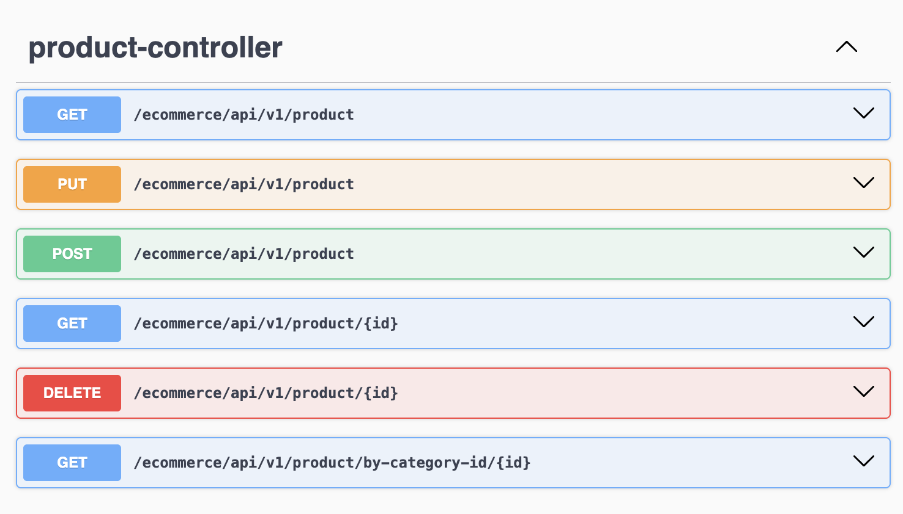
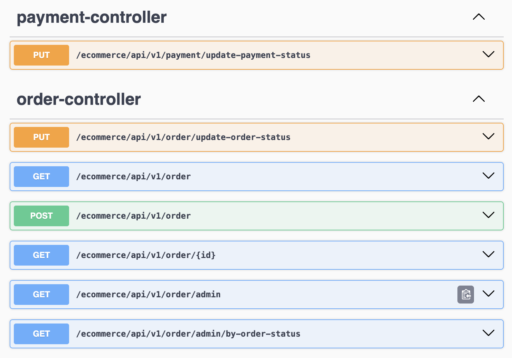
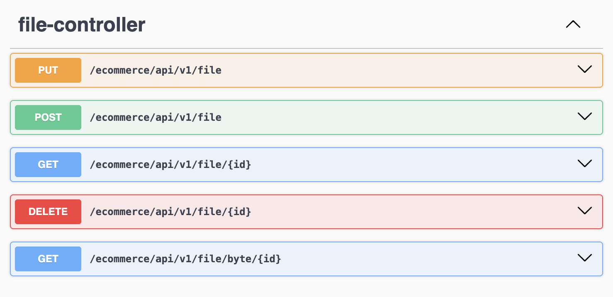
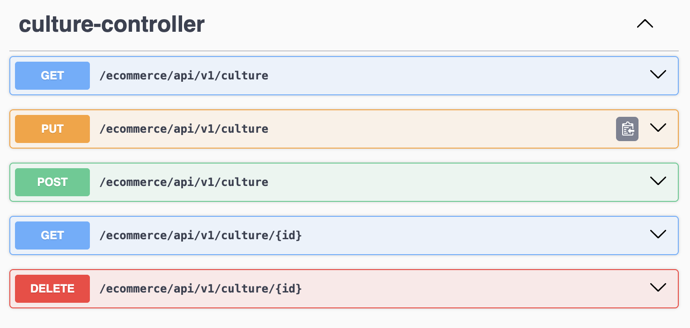
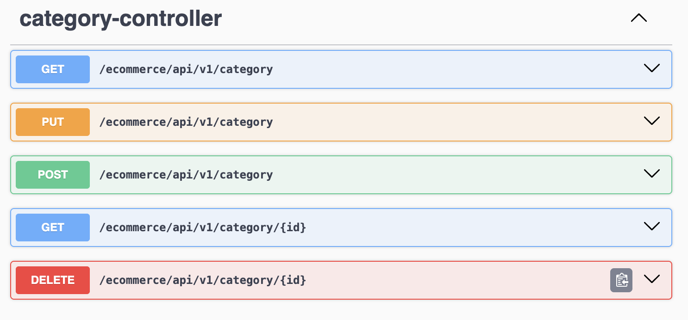
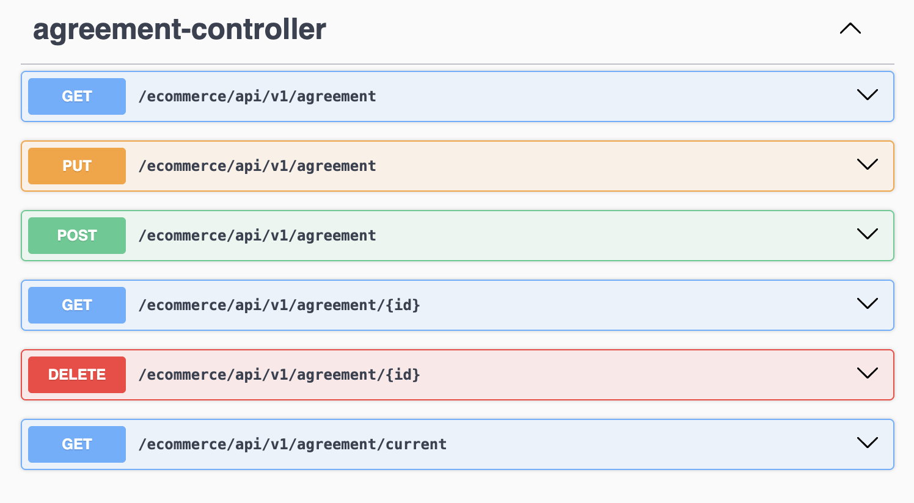
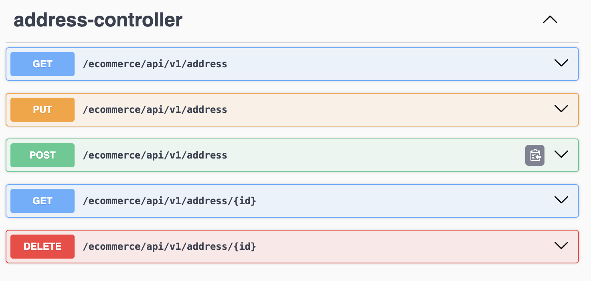
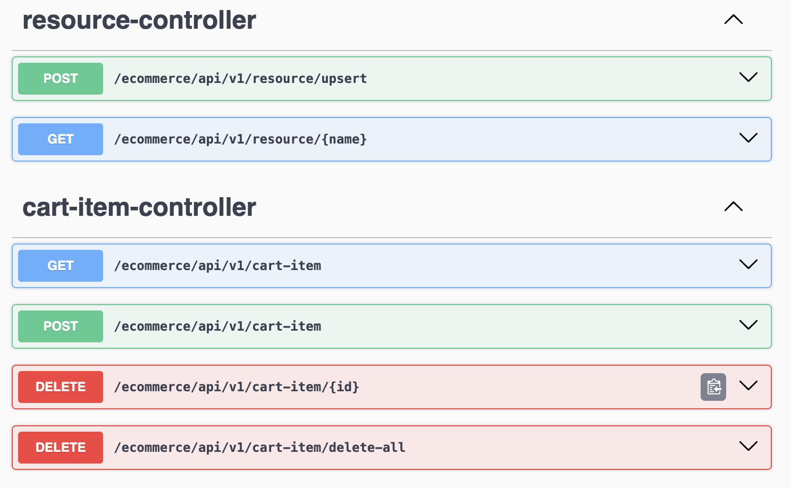
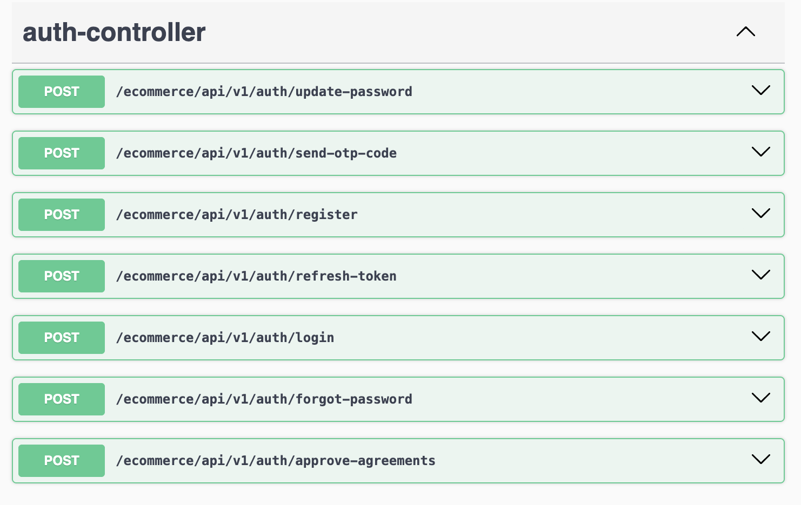

# ECommerce API

A simple E-Commerce system built with Java 21 and Spring Boot.

## ⚙️ Tech Stack

- Java 21
- Spring Boot
    - Spring Web
    - Spring Security JWT
    - Spring Data JPA
- MySQL
- Lombok
- OpenAPI / Swagger

### 🛠️ MySQL Configuration

Set up a local MySQL instance with the following credentials:

- **Username:** `root`
- **Password:** `root`
- **Database URL:** `jdbc:mysql://localhost:3306/e_commerce_dev`

## 🚀 Getting Started

### Clone the Repository

```bash
git clone https://github.com/huseyinozkan/ECommerceApi.git
cd ECommerceApi
```

### 🛠️ Build and Run the Project

To set up and run the project locally, execute the following commands in your terminal:

```bash
# Cleans previous builds and compiles the project
./gradlew clean build

# Starts the application
./gradlew bootRun
```

### 🔐 JWT (JSON Web Token) Authentication

To access protected endpoints, you can authenticate using the following credentials:

- **Username:** `admin`
- **Password:** `123123`

After logging in, you will receive a JWT token which should be included in the `Authorization` header of your requests.

#### Swagger UI Doc
[http://localhost:8082/swagger-ui/index.html](http://localhost:8082/swagger-ui/index.html)











